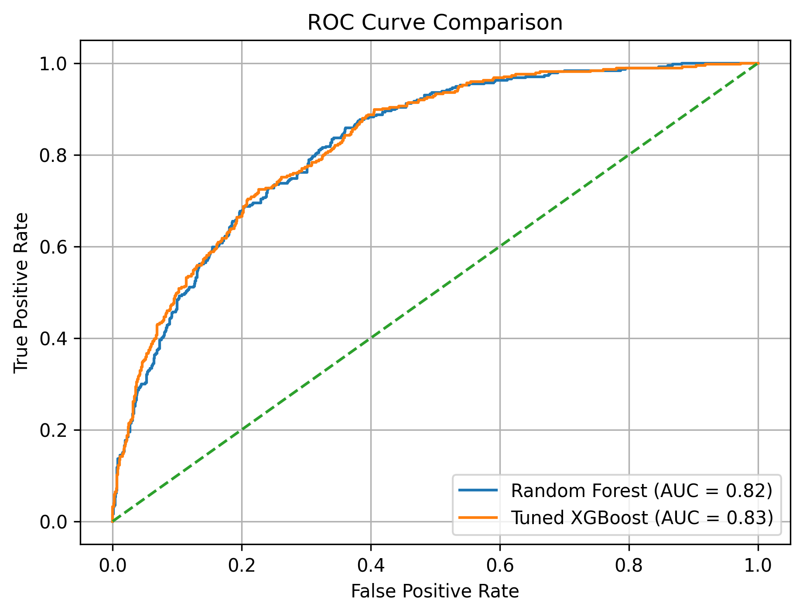
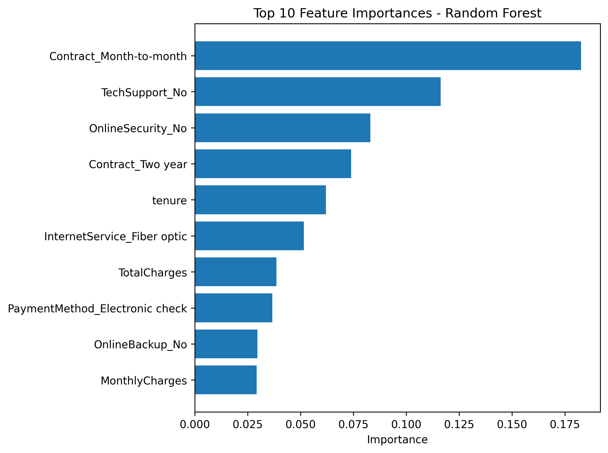
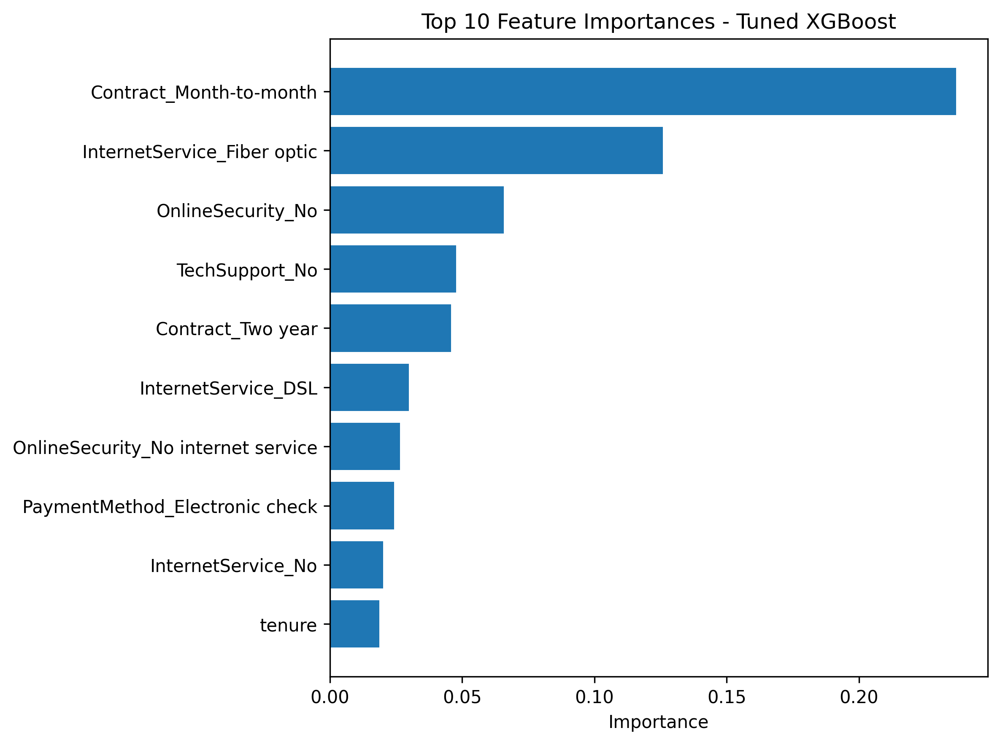

# customer-churn-prediction
End-to-end ML project predicting telecom customer churn. Includes EDA, feature engineering, SMOTEENN oversampling, Random Forest vs XGBoost model comparison, visual evaluation, GitHub documentation, and business insights.
## Model Performance

### Confusion Matrix (Random Forest vs Tuned XGBoost)

### ROC Curve Comparison

### Feature Importance – Random Forest

### Feature Importance – XGBoost

